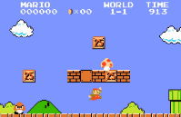

## **Identifying and Defining**

### **Identifying a Need**
#### Game Idea:
The game I am going to make is a 2D Platformer with a ninja character that runs through a dojo and collects coins, with a boss fight at the end.

#### Brainstorming:
* Ninja getting through obstacles in dojo to become master
* Flappy bird inspired game
* Mario inspired platformer game

#### Need:
The need for my game is to repopularise 2D platformers with an engaging and attractive game.

#### Problem Statement:
Loss of interest and demand for 2D platformers has been evident. My game addresses this with fun design and unique/challenging obstacles, as well as a boss fight at the end. This will attract and repopularise the 2D platformer genre as a whole.

#### Skill Development:
To develop the skills required to create this game, I would watch through this 2D platformer tutorial youtube playlist: https://www.youtube.com/watch?v=-ixk2uxEc94&list=PLiyfvmtjWC_Up8XNvM3OSqgbJoMQgHkVz&pp=iAQB

### **Requirements Outline**
#### Inputs:
User inputs will include arrow, WASD keys and the spacebar for movement (W key, the up arrow key, and the space bar for jumping), shift button for sprinting, and ctrl button for crouching, mouse button 1 for attacking and pressing button in menu, and mouse button 2 for blocking.

#### Processing:
The program will check for collision and calculate the new position of the player.

#### Outputs:
The game will display the character's new position, a game-over message, and the player's progress/score.

#### Transmission:
My game will not require any data transmission.

#### Storage:
The game will not store any data as there are levels.

### **Functional Requirements**
#### User Interaction:
The user interacts using keyboard commands for advanced movement, and mouse clicks for to select/press buttons on the menu/defeat screen resulting in either the game ending or you restart. Mouse clicks are also used for your character to attack or block.

#### Core Gameplay:
My game includes mechanics like advanced movement and combat. For the movement, the character will move, the advanced part includes sprinting and crouching. Crouching lowers the players hitbox, and sprinting makes the player run faster. For combat, there is just an attack and a block button which reflects projectiles.

#### Scoring and Feedback:
My game will have a form of a progress tracker, which tracks how many coins you have collected and will also display how many coins you need to collect to progress to the next level. The progress system triggers whenever you touch/collect a coin.

#### Level Progression:
To move onto the next level in my game, you have to get past all the obstacles and collect all the coins, then you will progress onto the next level.

### **Non-Functional Requirements Instructions**
#### Performance Requirements:
The game should load in under 5 seconds and have low input delay.

#### Usability Requirements:
The game should include instructions/tutorials to explain the core mechanics to new users.

#### Compatibility Requirements:
The game must be compatible on PC with mouse and keyboard.

#### Scalability Requirements:
The game should be able to scale for the addition of new levels and features without impacting performance.

### **Consideration of Social and Ethical Issues**
Equity: Equity refers to the quality of being fair and impartial.

Accessibility: Accessibility refers to the quality of being easy to obtain or use.

#### Accessibility:
My project will be usable by most people as there are subtitles, but lacks the ability to change controls or adjust the game visually, which could make my game unusable to some.

#### Privacy and Data Protection:
My project will not collect any user data to ensure privacy and the safety of the user.

#### Fairness and Representation:
My project avoids gender, race, or cultural stereotypes as it is a simple game with a simple concept, just with some changes to characters and the setting, and possibly mechanics. I will make sure to do some research on ninja culture to make sure I am not misrepresenting or disrespecting it.

#### Mental and Emotional Well-Being:
My game doesn't affect users' mental health as it does not contain graphic content. It is supposed to be a cartoony, fun and challenging 2D platformer with combat and boss mechanics, which promotes a positive and child-friendly experience.

#### Cultural Sensitivities:
My game could be offensive to some cultures, but I will make sure to do research before adding stuff in to not disrespect any culture.

## **Researching and Planning**
### **PMI Table**
| Existing Idea | Plus | Minus | Implication |
| :---- | :---- | :---- | :---- |
| Super Mario Bros  | Super Mario Bros has done well with a simple idea of a platformer. I like that some obstacles and enemies can cause your character to lose a life.  | This is a simple game. It lacks engagement and content and gets repetitive over time. Also, it isn’t very challenging. | I will implement a life system (3 lives) and obstacles/enemies that take away 1 life from you. I will avoid simple and repetitive levels. |
| Cuphead  | Cuphead has done boss battles well, it implements hard and challenging boss battles that shoot projectiles that you have to dodge. You also have to attack the boss until it dies. The graphics are cartoonish and have nice animations. | In Cuphead, the boss battles might be too hard, can controls might be too complicated for younger children. The graphics might not be suitable for children. | I will implement interactive boss battles, make the boss shoot projectiles at the player, but not make it too difficult, and use stunning graphics to attract and engage players of all ages. |
| Sonic The Hedgehog  | Sonic The Hedgehog has used an interesting coin system, sprinting/boosting and crouching movement system, and unique obstacles. | The obstacles might be too easy/simple, so it disengages players and reduces the replayability. | I will avoid easy and repetitive levels and obstacles, and I will implement the coin system, and sprinting/crouching movement system to add variety to my game. |

### **Pseudocode and Flowchart**

